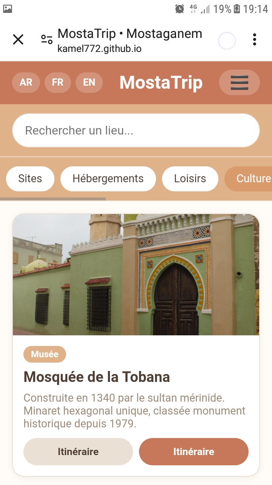

# CityTrip Framework

[](https://kamel772.github.io/algeriantrip/app.html)
[](LICENSE)
[](https://kamel772.github.io/algeriantrip/app.html)

**Build an offline-capable, mobile-first tourism guide for any city — in minutes.**

> **CityTrip** is a lightweight, zero‑cost Progressive Web App (PWA) that allows you to create a complete travel guide for any city in the world. No servers, no monthly fees, no complex setup. Just edit a single data file and get a fully functional app ready to be shared.



## 🏙️ What does it do?

CityTrip is a smartphone‑friendly mobile guide that includes:
- **🗺️ Detailed listings** for historical sites, beaches, hotels, artisans, restaurants, administrations, banks, and more.
- **🔍 Instant search & smart filters** (by category).
- **📸 Photo galleries** for each place.
- **📍 One‑tap Google Maps directions**.
- **📝 Local booking/contact forms** (saved on the device, no server needed).
- **🌐 Multilingual interface** (already contains Arabic, French, English — easily extendable).
- **📴 Offline‑first** works without internet once loaded (except maps).

## ⚡ Quick Start

1. **Clone** this repository.
2. Open `data/demo.js` and replace the sample places with your city’s data.
3. Open `index.html` in a browser — it works directly from your computer or phone.
4. To share it with the world, host it on [GitHub Pages](https://pages.github.com/).

That’s it. You now have a mobile app that anyone can add to their home screen.

## 📁 Project Structure

```

├── index.html          # Main app (loads data dynamically)
├── style.css           # Styling (17 built‑in themes, customizable)
├── main.js             # Core logic
├── booking.js          # Booking form handler
├── manifest.json       # PWA manifest
├── sw.js               # Offline service worker
└── data/
├── mostaganem.js   # Complete example: +45 places in Mostaganem, Algeria
└── demo.js         # Starter file with 10 sample places

```
## 🎨 Themes

CityTrip supports multiple color themes via a simple CSS class on `<body>`.  
Try `theme-airbnb`, `theme-spotify`, `theme-santorini`, `theme-maldives`, etc.  
You can easily create your own by copying one of the variables blocks in `style.css`.

## 🌍 Use it for your city

CityTrip is not limited to Algeria. It can be used for:
- Promoting cultural heritage and tourism in developing countries.
- Providing essential services information for underserved communities.
- Creating a digital catalog for local artisans and businesses.

**No coding skills required** — just fill in the data file. A trained municipal employee can update the listings in minutes.

## 🤝 Contributing

Contributions are welcome! If you create a dataset for a new city, you can submit a pull request. Let’s build the world’s most accessible local guide network.

## 📜 License

Ce projet est sous licence Creative Commons Attribution – Pas d'Utilisation Commerciale 4.0 International (CC BY-NC 4.0).  
Cela signifie que vous pouvez l'utiliser, le modifier et le partager librement à des fins non commerciales.  
Pour toute utilisation commerciale, une autorisation préalable de l'auteur est nécessaire.

[](LICENSE)

© 2026 BENAICHA KAMEL. Tous droits réservés.

## 📧 Contact

**Author:** BENAICHA KAMEL  
**Email:** benaichakamelkat@gmail.com  
**WhatsApp:** +213 771 70 35 36

*If you want a custom version for your city, feel free to reach out.*


